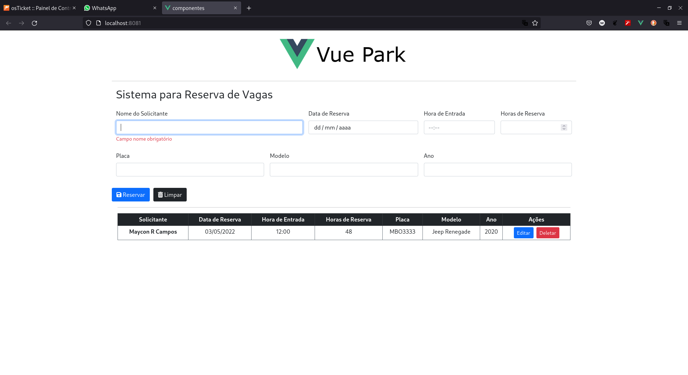
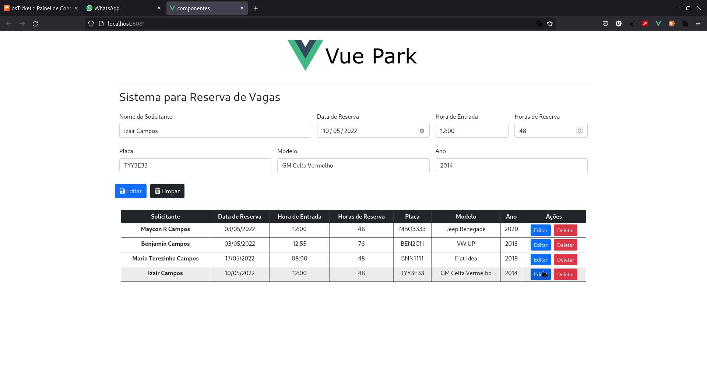
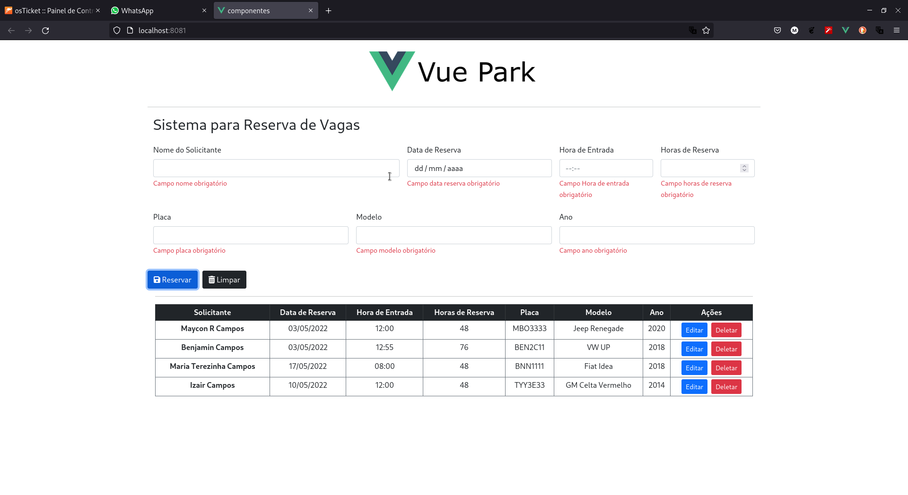

<h1>Projeto Vue Park</h1>

<h3>Exercitando os seguintes conceitos com VueJS</h3>
<ul>
    <li>Componentização</li>
    <li>Comunicação entre componentes com Props e Emit</li>
    <li>Centralizando Store com Pinia</li>
    <li>Validação de Formulário</li>
</ul>

<h2>Projeto proposto pelo prof Gilmar Bennert, cujo nome original é My-Parking.</h2>

<h3>Características do Aplicativo: Componentes </h3>

<ul>
    <li>Header - Componente estático</li>
    <li>Button - Componente reutilizável que emite um comando ao arquivo App.vue.</li>
    <li>Formulário - Cujos campos alteram o estado da store.</li>
    <li>Tabela - Recebe dados da store via props para renderizar a tabela.</li>
</ul>


<h2>Prints</h2>

<h3>01</h3>



# componentes


<h1>Instruções para clonar este projeto.</h1>
## Project setup
```
npm install
```

### Compiles and hot-reloads for development
```
npm run serve
```

### Compiles and minifies for production
```
npm run build
```

### Lints and fixes files
```
npm run lint
```

### Customize configuration
See [Configuration Reference](https://cli.vuejs.org/config/).
